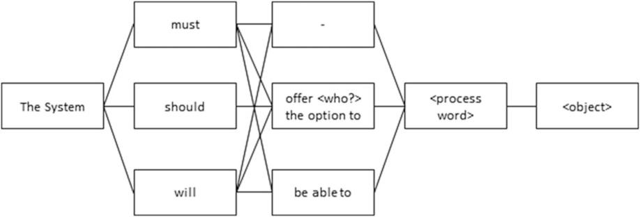

# moleculerbpmnwebpackloader
webpack loader of bpmn as microservice moleculer module.

this is my shitcode while reading [Process-Driven Applications with BPMN](https://www.amazon.com/Process-Driven-Applications-BPMN-Volker-Stiehl/dp/331907217X/)

```javascript
const {  } = require('moleculerbpmn!./main.bpmn')
```
## inspired by [zeebe](https://docs.zeebe.io/)

Microservice name schema `servicename.commandname`



Who can monitor the process to get an idea of its progress status? is the logs enough to mock the playback for another engine version test?

Horizontal communication on moleculer land inside docker.

## todo
- [ ] webpack loader install
- [ ] webpack invocation example